---
## Front matter
title: "Отчёт по лабораторной работе №2"
subtitle: "Дисциплина: архитектура компьютера"
author: "Булыгин Николай Александрович"

## Generic otions
lang: ru-RU
toc-title: "Содержание"

## Bibliography
bibliography: bib/cite.bib
csl: pandoc/csl/gost-r-7-0-5-2008-numeric.csl

## Pdf output format
toc: true # Table of contents
toc-depth: 2
lof: true # List of figures
lot: true # List of tables
fontsize: 12pt
linestretch: 1.5
papersize: a4
documentclass: scrreprt
## I18n polyglossia
polyglossia-lang:
  name: russian
  options:
	- spelling=modern
	- babelshorthands=true
polyglossia-otherlangs:
  name: english
## I18n babel
babel-lang: russian
babel-otherlangs: english
## Fonts
mainfont: IBM Plex Serif
romanfont: IBM Plex Serif
sansfont: IBM Plex Sans
monofont: IBM Plex Mono
mathfont: STIX Two Math
mainfontoptions: Ligatures=Common,Ligatures=TeX,Scale=0.94
romanfontoptions: Ligatures=Common,Ligatures=TeX,Scale=0.94
sansfontoptions: Ligatures=Common,Ligatures=TeX,Scale=MatchLowercase,Scale=0.94
monofontoptions: Scale=MatchLowercase,Scale=0.94,FakeStretch=0.9
mathfontoptions:
## Biblatex
biblatex: true
biblio-style: "gost-numeric"
biblatexoptions:
  - parentracker=true
  - backend=biber
  - hyperref=auto
  - language=auto
  - autolang=other*
  - citestyle=gost-numeric
## Pandoc-crossref LaTeX customization
figureTitle: "Рис."
tableTitle: "Таблица"
listingTitle: "Листинг"
lofTitle: "Список иллюстраций"
lotTitle: "Список таблиц"
lolTitle: "Листинги"
## Misc options
indent: true
header-includes:
  - \usepackage{indentfirst}
  - \usepackage{float} # keep figures where there are in the text
  - \floatplacement{figure}{H} # keep figures where there are in the text
---

# Цель работы

Целью работы является изучение идеологии и применения средств контроля версий и приобретение практических навыков по работе с системой git.

# Задание

1. Настройка GitHub
2. Базовая настройка git
3. Создание SSH ключа
4. Создание рабочего пространства
5. Создание репозитория курса на основе шалблона
6. Настройка каталога курса
7. Выполнение самостоятельной работы

# Выполнение лабораторной работы

## Настройка GitHub

На сайте GitHub у меня уже есть учётная запись с заполненными основными данными, поэтому пользоваться буду ей (рис. [-@fig:001]).

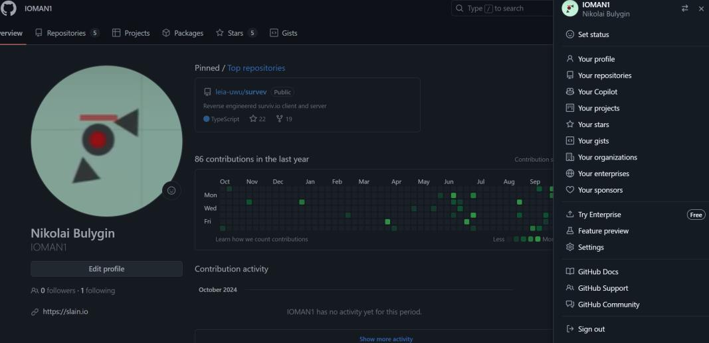{#fig:001 width=70%}

## Базовая настройка Git

Делаю предварительную конфигурацию git (рис. [-@fig:002]).

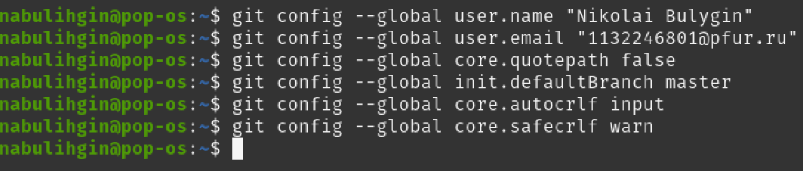{#fig:002 width=70%}

## Создание SSH ключа

Генерирую пару ключей (рис. [-@fig:003]).

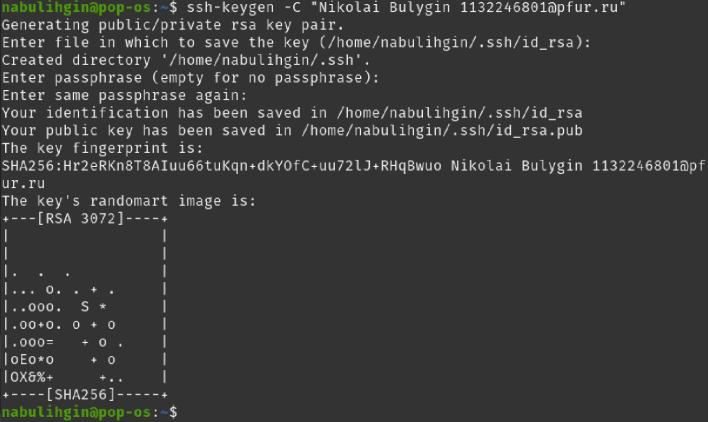{#fig:003 width=70%}

Копирую сгенерированный ключ, предварительно установив отсутствующую утилиту xclip (рис. [-@fig:004]).

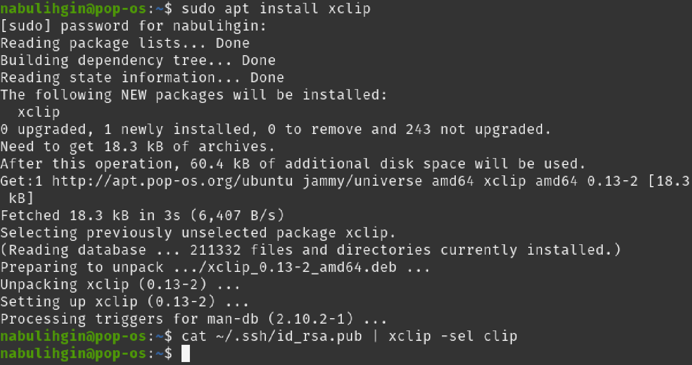{#fig:004 width=70%}

Захожу на GitHub и сохраняю ключ там (рис. [-@fig:005]).

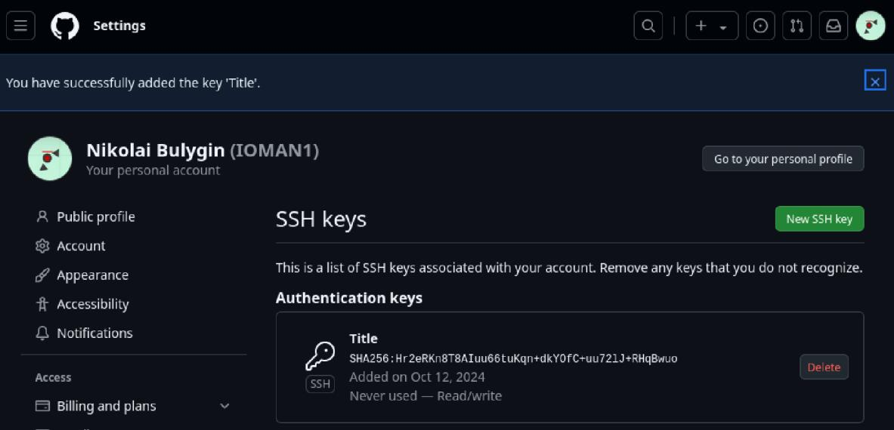{#fig:005 width=70%}

## Создание рабочего пространства

Создаю все нужные директории с помощью команды mkdir и проверяю наличие новых директориев командой ls (рис. [-@fig:006]).

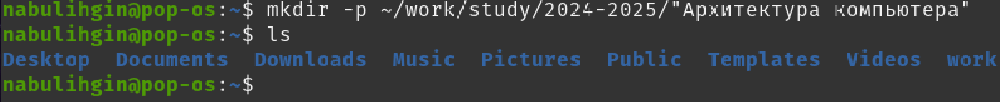{#fig:006 width=70%}

## Создание репозитория курса на основе шаблона

Открываю страницу репозитория с шаблоном курса на GitHub и с помощью него создаю репозиторий курса (рис. [-@fig:007]).

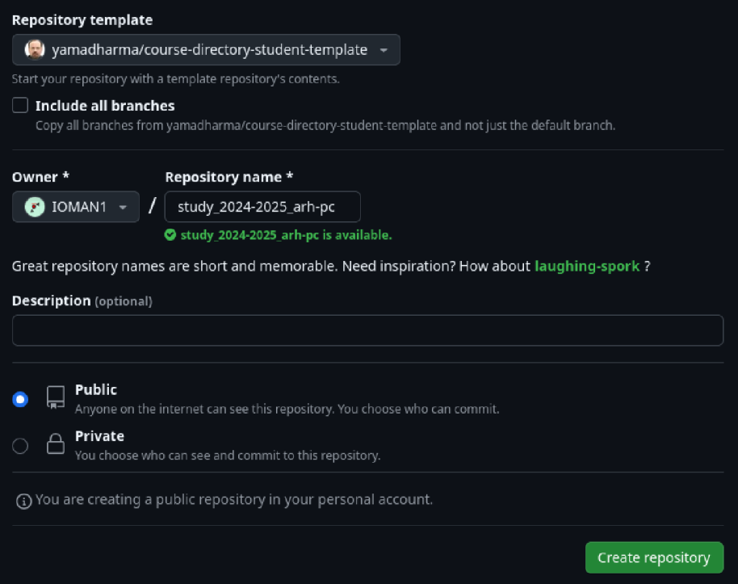{#fig:007 width=70%}

Копирую ссылку для клонирования созданного репозитория (рис. [-@fig:008]).

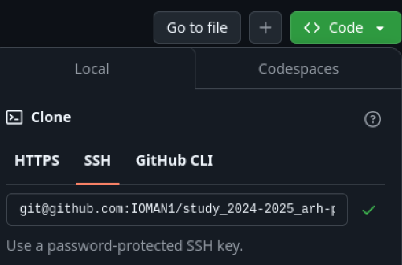{#fig:008 width=70%}

Далее открываю терминал, перехожу в каталог курса и клонирую созданный репозиторий с помощью раннее скопированной ссылки (рис. [-@fig:009]).

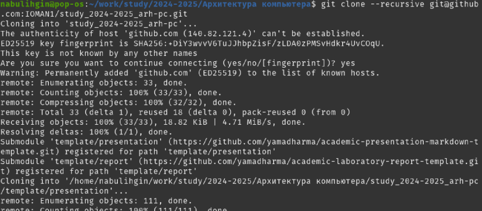{#fig:009 width=70%}

## Настройка каталога курса

Перехожу в каталог курса и удаляю лишние файлы (рис. [-@fig:010]).

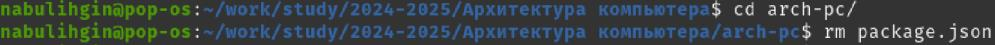{#fig:010 width=70%}

Создаю необходимые каталоги (рис. [-@fig:011]).

{#fig:011 width=70%}

Отправляю файлы на сервер (рис. [-@fig:012] и рис. [-@fig:013]).

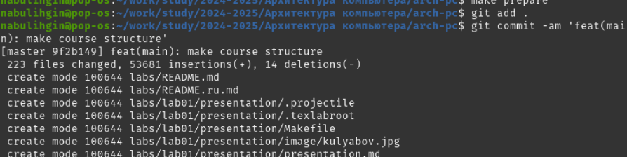{#fig:012 width=70%}

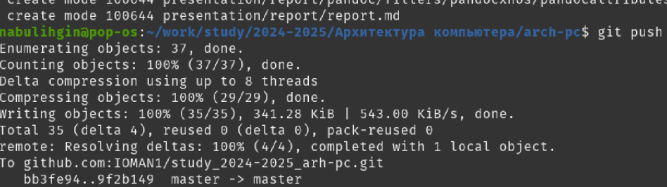{#fig:013 width=70%}

Проверю правильность сохранения иерархии рабочего пространства в локальном репозитории и на странице GitHub (рис. [-@fig:014] и рис. [-@fig:015]).

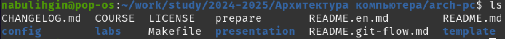{#fig:014 width=70%}

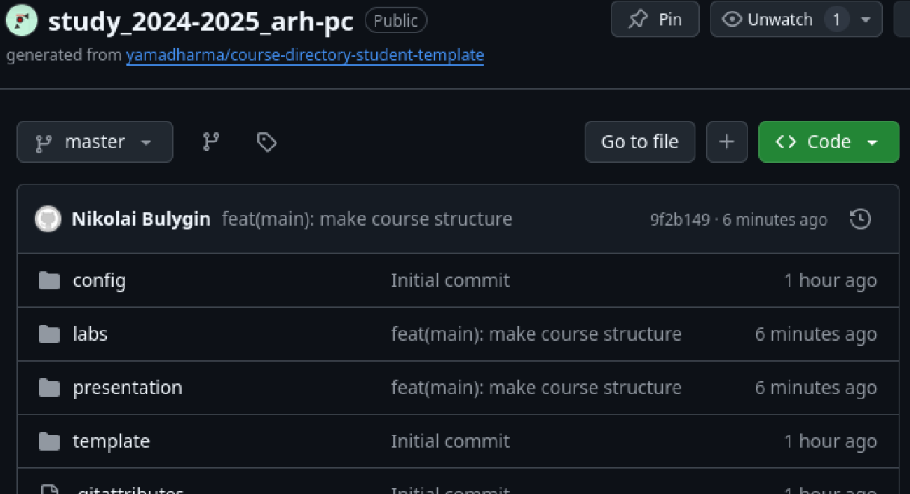{#fig:015 width=70%}

## Выполнение самостоятельной работы

Создаю отчёт по лабораторной работе и переношу его в соответствующий каталог рабочего пространства (рис. [-@fig:016]).

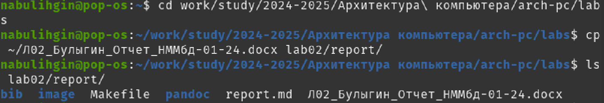{#fig:016 width=70%}

Копирую отчёт по предыдущей лабораторной работе в соответствующий каталог рабочего пространства (рис. [-@fig:017]).

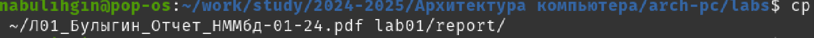{#fig:017 width=70%}

Загружаю файлы на GitHub (рис. [-@fig:018]).

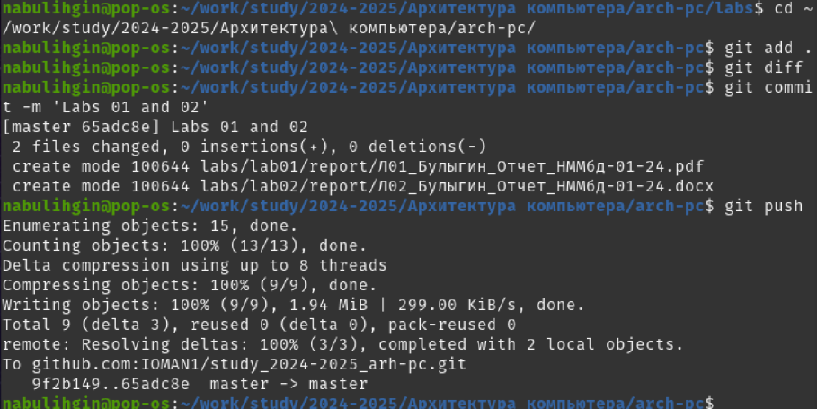{#fig:018 width=70%}

# Выводы

При выполнении данной лабораторной работы я приобрёл практические навыки по работе с системой git, а также изучил идеологию и применение средств контроля версий.
