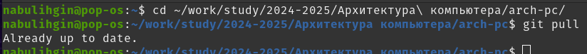
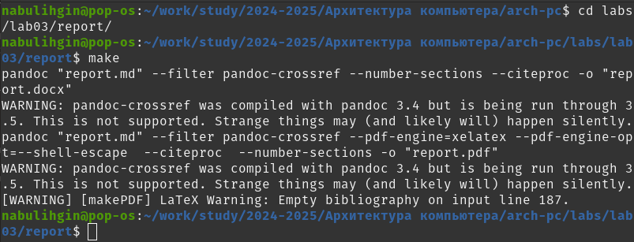
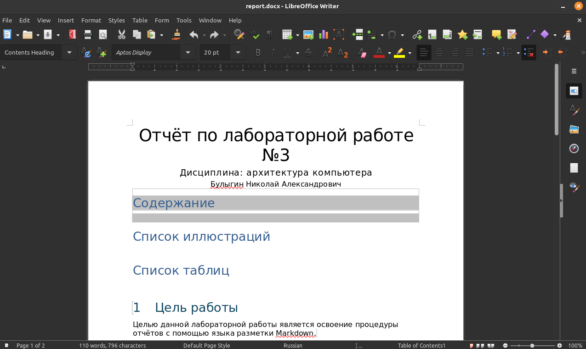
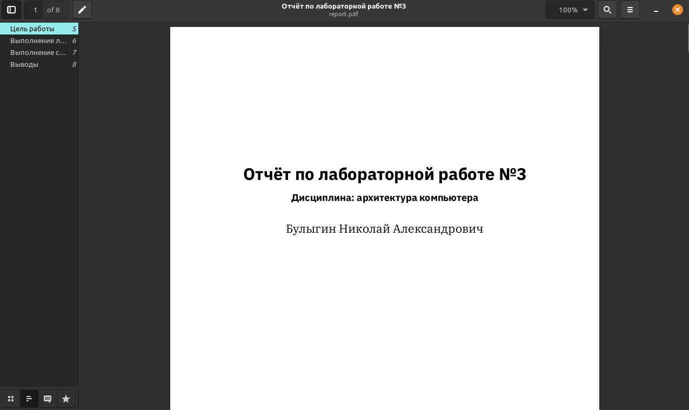
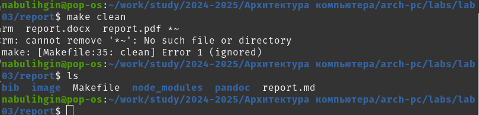
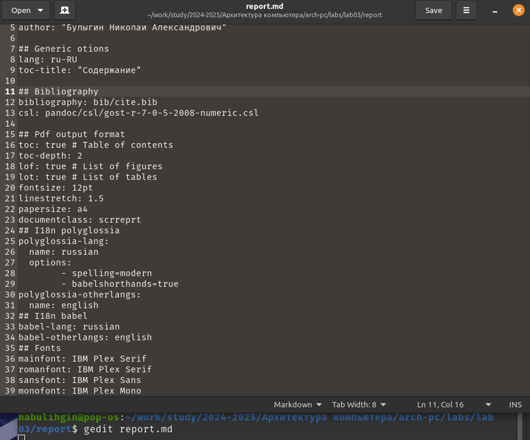
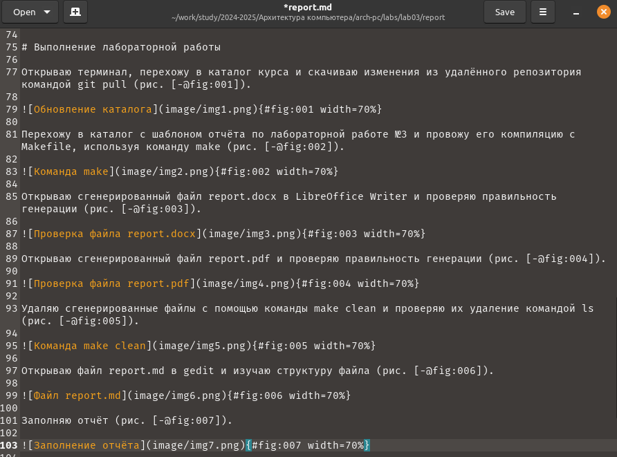

---
## Front matter
title: "Отчёт по лабораторной работе №3"
subtitle: "Дисциплина: архитектура компьютера"
author: "Булыгин Николай Александрович"

## Generic otions
lang: ru-RU
toc-title: "Содержание"

## Bibliography
bibliography: bib/cite.bib
csl: pandoc/csl/gost-r-7-0-5-2008-numeric.csl

## Pdf output format
toc: true # Table of contents
toc-depth: 2
lof: true # List of figures
lot: true # List of tables
fontsize: 12pt
linestretch: 1.5
papersize: a4
documentclass: scrreprt
## I18n polyglossia
polyglossia-lang:
  name: russian
  options:
	- spelling=modern
	- babelshorthands=true
polyglossia-otherlangs:
  name: english
## I18n babel
babel-lang: russian
babel-otherlangs: english
## Fonts
mainfont: IBM Plex Serif
romanfont: IBM Plex Serif
sansfont: IBM Plex Sans
monofont: IBM Plex Mono
mathfont: STIX Two Math
mainfontoptions: Ligatures=Common,Ligatures=TeX,Scale=0.94
romanfontoptions: Ligatures=Common,Ligatures=TeX,Scale=0.94
sansfontoptions: Ligatures=Common,Ligatures=TeX,Scale=MatchLowercase,Scale=0.94
monofontoptions: Scale=MatchLowercase,Scale=0.94,FakeStretch=0.9
mathfontoptions:
## Biblatex
biblatex: true
biblio-style: "gost-numeric"
biblatexoptions:
  - parentracker=true
  - backend=biber
  - hyperref=auto
  - language=auto
  - autolang=other*
  - citestyle=gost-numeric
## Pandoc-crossref LaTeX customization
figureTitle: "Рис."
tableTitle: "Таблица"
listingTitle: "Листинг"
lofTitle: "Список иллюстраций"
lotTitle: "Список таблиц"
lolTitle: "Листинги"
## Misc options
indent: true
header-includes:
  - \usepackage{indentfirst}
  - \usepackage{float} # keep figures where there are in the text
  - \floatplacement{figure}{H} # keep figures where there are in the text
---

# Цель работы

Целью данной лабораторной работы является освоение процедуры отчётов с помощью языка разметки Markdown.

# Задание

1. Выполнение основных заданий
2. Выполнение самостоятельной работы

# Выполнение лабораторной работы

## Выполнение основных заданий

Открываю терминал, перехожу в каталог курса и скачиваю изменения из удалённого репозитория командой git pull (рис. [-@fig:001]).

{#fig:001 width=70%}

Перехожу в каталог с шаблоном отчёта по лабораторной работе №3 и провожу его компиляцию с Makefile, используя команду make (рис. [-@fig:002]).

{#fig:002 width=70%}

Открываю сгенерированный файл report.docx в LibreOffice Writer и проверяю правильность генерации (рис. [-@fig:003]).

{#fig:003 width=70%}

Открываю сгенерированный файл report.pdf и проверяю правильность генерации (рис. [-@fig:004]).

{#fig:004 width=70%}

Удаляю сгенерированные файлы с помощью команды make clean и проверяю их удаление командой ls (рис. [-@fig:005]).

{#fig:005 width=70%}

Открываю файл report.md в gedit и изучаю структуру файла (рис. [-@fig:006]).

{#fig:006 width=70%}

Заполняю отчёт (рис. [-@fig:007]).

{#fig:007 width=70%}

Компилирую отчет и загружаю его на GitHub.

## Выполнение самостоятельной работы

Переписываю лабораторную работу №2 в Markdown и загружаю все файлы на репозиторий GitHub ([https://github.com/IOMAN1/study_2024-2025_arh-pc](https://github.com/IOMAN1/study_2024-2025_arh-pc)).

# Выводы

Я овладел практическими навыками легковесного языка разметки Markdown.
