---
## Front matter
title: "Отчёт по лабораторной работе №4"
subtitle: "Дисциплина: архитектура компьютера"
author: "Булыгин Николай Александрович"

## Generic otions
lang: ru-RU
toc-title: "Содержание"

## Bibliography
bibliography: bib/cite.bib
csl: pandoc/csl/gost-r-7-0-5-2008-numeric.csl

## Pdf output format
toc: true # Table of contents
toc-depth: 2
lof: true # List of figures
lot: true # List of tables
fontsize: 12pt
linestretch: 1.5
papersize: a4
documentclass: scrreprt
## I18n polyglossia
polyglossia-lang:
  name: russian
  options:
	- spelling=modern
	- babelshorthands=true
polyglossia-otherlangs:
  name: english
## I18n babel
babel-lang: russian
babel-otherlangs: english
## Fonts
mainfont: IBM Plex Serif
romanfont: IBM Plex Serif
sansfont: IBM Plex Sans
monofont: IBM Plex Mono
mathfont: STIX Two Math
mainfontoptions: Ligatures=Common,Ligatures=TeX,Scale=0.94
romanfontoptions: Ligatures=Common,Ligatures=TeX,Scale=0.94
sansfontoptions: Ligatures=Common,Ligatures=TeX,Scale=MatchLowercase,Scale=0.94
monofontoptions: Scale=MatchLowercase,Scale=0.94,FakeStretch=0.9
mathfontoptions:
## Biblatex
biblatex: true
biblio-style: "gost-numeric"
biblatexoptions:
  - parentracker=true
  - backend=biber
  - hyperref=auto
  - language=auto
  - autolang=other*
  - citestyle=gost-numeric
## Pandoc-crossref LaTeX customization
figureTitle: "Рис."
tableTitle: "Таблица"
listingTitle: "Листинг"
lofTitle: "Список иллюстраций"
lotTitle: "Список таблиц"
lolTitle: "Листинги"
## Misc options
indent: true
header-includes:
  - \usepackage{indentfirst}
  - \usepackage{float} # keep figures where there are in the text
  - \floatplacement{figure}{H} # keep figures where there are in the text
---

# Цель работы

Целью данной лабораторной работы является освоение процедуры компиляции и сборки программ, написанных на ассемблере NASM.

# Задание

1. Программа Hello world!
2. Транслятор NASM
3. Расширенный синтаксис командной строки NASM
4. Компоновщик LD
5. Запуск исполняемого файла
6. Выполнение самостоятельной работы

# Выполнение лабораторной работы

## Программа Hello world!

Открываю терминал, создаю каталог для работы с программами на языке ассемблера NASM, перехожу в него и создаю там текстовый файл hello.asm (рис. [-@fig:001]).

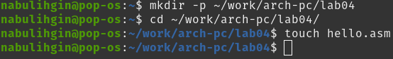{#fig:001 width=70%}

Открываю созданный файл в gedit и ввожу в него данный код (рис. [-@fig:002]).

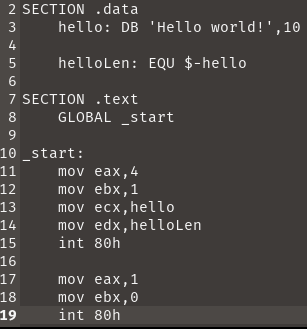{#fig:002 width=70%}

## Транслятор NASM

Компилирую код программы с помощью nasm, затем командой ls проверяю правильность создания объектного файла. Вижу, что этот файл присутствует и имеет имя hello.o (рис. [-@fig:003]).

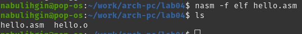{#fig:003 width=70%}

## Расширенный синтаксис командной строки NASM

Выполняю данную команду, имеющую расширенный синтаксис. Далее проверяю создание объектного файла obj.o и файла листинга list.lst (рис. [-@fig:004]).

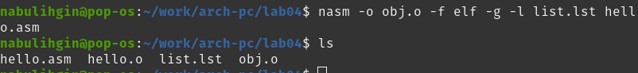{#fig:004 width=70%}

## Компоновщик LD

Передаю объектный файл hello.o на обработку компоновщику LD и проверяю его работу (рис. [-@fig:005]).

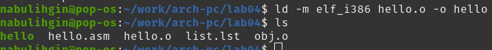{#fig:005 width=70%}

Выполняю данную команду. Она собирает исполняемый файл main из объектного файла obj.o, который я скомпилировал ранее (рис. [-@fig:006]).

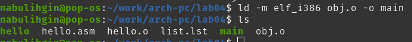{#fig:006 width=70%}

## Запуск исполняемого файла

Запускаю созданный мною исполняемый файл hello. Он выводит 'Hello world!', следовательно все мои действия были выполнены без ошибок (рис. [-@fig:007]).

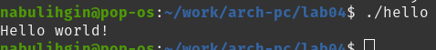{#fig:007 width=70%}

## Выполнение самостоятельной работы

В данном каталоге создаю копию файла hello.asm с именем lab4.asm (рис. [-@fig:008]).

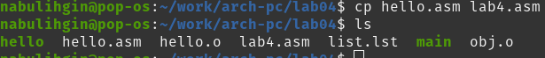{#fig:008 width=70%}

В файле lab4.asm меняю строчку 'Hello world!' на 'Булыгин Николай' (рис. [-@fig:009]).

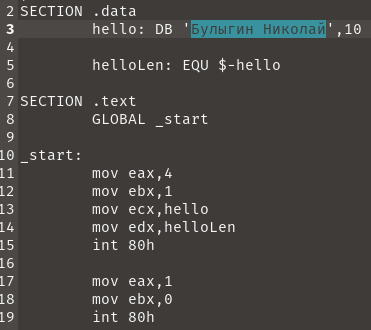{#fig:009 width=70%}

Код программы:

```NASM
SECTION .data
	hello: DB 'Булыгин Николай',10

	helloLen: EQU $-hello
	
SECTION .text
	GLOBAL _start
	
_start:
	mov eax,4
	mov ebx,1
	mov ecx,hello
	mov edx,helloLen
	int 80h
	
	mov eax,1
	mov ebx,0
	int 80h
```

Из lab4.asm создаю объектный файл lab4.o, выполняю его компоновку и запускаю получившийся исполняемый файл lab4. Он выводит мои инициалы (рис. [-@fig:010]).

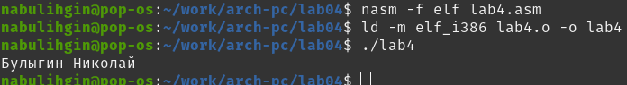{#fig:010 width=70%}

Копирую файлы hello.asm и lab4.asm в мой локальный репозиторий (рис. [-@fig:011]).

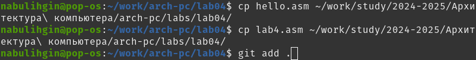{#fig:011 width=70%}

Загружаю отчёт на GitHub.

# Выводы

Я освоил процедуры компиляции и сборки программ, написанных на ассемблере NASM.
