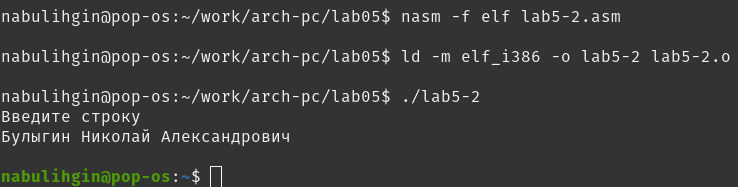

---
## Front matter
title: "Отчёт по лабораторной работе №5"
subtitle: "Дисциплина: архитектура компьютера"
author: "Булыгин Николай Александрович"

## Generic otions
lang: ru-RU
toc-title: "Содержание"

## Bibliography
bibliography: bib/cite.bib
csl: pandoc/csl/gost-r-7-0-5-2008-numeric.csl

## Pdf output format
toc: true # Table of contents
toc-depth: 2
lof: true # List of figures
lot: true # List of tables
fontsize: 12pt
linestretch: 1.5
papersize: a4
documentclass: scrreprt
## I18n polyglossia
polyglossia-lang:
  name: russian
  options:
	- spelling=modern
	- babelshorthands=true
polyglossia-otherlangs:
  name: english
## I18n babel
babel-lang: russian
babel-otherlangs: english
## Fonts
mainfont: IBM Plex Serif
romanfont: IBM Plex Serif
sansfont: IBM Plex Sans
monofont: IBM Plex Mono
mathfont: STIX Two Math
mainfontoptions: Ligatures=Common,Ligatures=TeX,Scale=0.94
romanfontoptions: Ligatures=Common,Ligatures=TeX,Scale=0.94
sansfontoptions: Ligatures=Common,Ligatures=TeX,Scale=MatchLowercase,Scale=0.94
monofontoptions: Scale=MatchLowercase,Scale=0.94,FakeStretch=0.9
mathfontoptions:
## Biblatex
biblatex: true
biblio-style: "gost-numeric"
biblatexoptions:
  - parentracker=true
  - backend=biber
  - hyperref=auto
  - language=auto
  - autolang=other*
  - citestyle=gost-numeric
## Pandoc-crossref LaTeX customization
figureTitle: "Рис."
tableTitle: "Таблица"
listingTitle: "Листинг"
lofTitle: "Список иллюстраций"
lotTitle: "Список таблиц"
lolTitle: "Листинги"
## Misc options
indent: true
header-includes:
  - \usepackage{indentfirst}
  - \usepackage{float} # keep figures where there are in the text
  - \floatplacement{figure}{H} # keep figures where there are in the text
---

# Цель работы

Целью данной лабораторной работы является приобретение практических навыков работы в Midnight Commander и освоение инструкций языка ассемблера mov и int.

# Задание

1. Midnight Commander
2. Подключение внешнего файла in_out.asm
3. Выполнение самостоятельной работы

# Выполнение лабораторной работы

## Midnight Commander

Открываю Midnight Commander, перехожу в каталог ~/work/arch-pc, создаю там папку lab05 и в ней создаю файл lab5-1.asm (рис. [-@fig:001]).

{#fig:001 width=70%}

Открываю созданный файл во встроенном редакторе mcedit и ввожу в него данный код (рис. [-@fig:002]).

{#fig:002 width=70%}

Сохраняю файл, выхожу из редактора и в режиме просмотра убеждаюсь в наличии кода программы (рис. [-@fig:003]).

{#fig:003 width=70%}

Транслирую lab5-1.asm в объектный файл, выполняю его компонировку и запускаю получившийся исполняемый файл. На запрос ввода строки ввожу свои инициалы (рис. [-@fig:004]).

{#fig:004 width=70%}

## Подключение внешнего файла in_out.asm

Скачиваю файл in_out.asm и копирую его в каталог работы (рис. [-@fig:005]).

{#fig:005 width=70%}

Создаю копию файла lab5-1.asm под названием lab5-2.asm и исправляю текст программы для работы с подключённым внешним файлом (рис. [-@fig:006]).

{#fig:006 width=70%}

Создаю исполняемый файл и проверяю его работу (рис. [-@fig:007]).

{#fig:007 width=70%}

Меняю sprintLF на sprint, теперь текст выводится на одной строке т.к. sprintLF работает так же, как и sprint, но добавляет к сообщению символ перевода строки (рис. [-@fig:008]).

{#fig:008 width=70%}

## Выполнение самостоятельной работы

Создаю копию файла lab5-1.asm под названием task1.asm и меняю код программы, чтобы она возвращала написанную строчку. Для вывода строки буду использовать вызов sys_write.

Код программы:

```NASM
SECTION .data
msg: DB 'Введите строку',10
msgLen: EQU $-msg

SECTION .bss
buf1: RESB 80

SECTION .text
GLOBAL _start
 _start:

 mov eax,4
 mov ebx,1
 mov ecx,msg
 mov edx,msgLen
 int 80h

 mov eax,3
 mov ebx,0
 mov ecx,buf1
 mov edx,80
 int 80h

; sys_write
 mov eax,4
 mov ebx,1
 int 80h

 mov eax,1
 mov ebx,0
 int 80h
```

Получаю исполняемый файл и проверяю работу написанной программы. Теперь она также возвращает написанную строчку (рис. [-@fig:009]).

{#fig:009 width=70%}

Аналогично первому заданию создаю копию файла lab5-2.asm под названием task2.asm и меняю код программы, чтобы она возвращала написанную строчку.

Код программы:

```NASM
%include 'in_out.asm'

SECTION .data
msg: DB 'Введите строку',0h

SECTION .bss
buf1: RESB 80

SECTION .text
GLOBAL _start
 _start:

 mov eax,msg
 call sprint
 mov ecx,buf1
 mov edx,80

 call sread

 mov eax,buf1
 call sprintLF ; Вывод строки

 call quit
```

Получаю исполняемый файл и проверяю работу написанной программы. Первый ввод идет без перевода строки т.к. в ходе лабораторной работы мы поменяли sprintLF на sprint в коде программы, которую скопировали (рис. [-@fig:010]).

{#fig:010 width=70%}

# Выводы

Я приобрел практические навыки работы в Midnight Commander и освоил инструкции языка ассемблера mov и int.
