---
## Front matter
title: "Отчёт по лабораторной работе №6"
subtitle: "Дисциплина: архитектура компьютера"
author: "Булыгин Николай Александрович"

## Generic otions
lang: ru-RU
toc-title: "Содержание"

## Bibliography
bibliography: bib/cite.bib
csl: pandoc/csl/gost-r-7-0-5-2008-numeric.csl

## Pdf output format
toc: true # Table of contents
toc-depth: 2
lof: true # List of figures
lot: true # List of tables
fontsize: 12pt
linestretch: 1.5
papersize: a4
documentclass: scrreprt
## I18n polyglossia
polyglossia-lang:
  name: russian
  options:
	- spelling=modern
	- babelshorthands=true
polyglossia-otherlangs:
  name: english
## I18n babel
babel-lang: russian
babel-otherlangs: english
## Fonts
mainfont: IBM Plex Serif
romanfont: IBM Plex Serif
sansfont: IBM Plex Sans
monofont: IBM Plex Mono
mathfont: STIX Two Math
mainfontoptions: Ligatures=Common,Ligatures=TeX,Scale=0.94
romanfontoptions: Ligatures=Common,Ligatures=TeX,Scale=0.94
sansfontoptions: Ligatures=Common,Ligatures=TeX,Scale=MatchLowercase,Scale=0.94
monofontoptions: Scale=MatchLowercase,Scale=0.94,FakeStretch=0.9
mathfontoptions:
## Biblatex
biblatex: true
biblio-style: "gost-numeric"
biblatexoptions:
  - parentracker=true
  - backend=biber
  - hyperref=auto
  - language=auto
  - autolang=other*
  - citestyle=gost-numeric
## Pandoc-crossref LaTeX customization
figureTitle: "Рис."
tableTitle: "Таблица"
listingTitle: "Листинг"
lofTitle: "Список иллюстраций"
lotTitle: "Список таблиц"
lolTitle: "Листинги"
## Misc options
indent: true
header-includes:
  - \usepackage{indentfirst}
  - \usepackage{float} # keep figures where there are in the text
  - \floatplacement{figure}{H} # keep figures where there are in the text
---

# Цель работы

Целью данной лабораторной работы является освоение арифметических инструкций языка ассмблера NASM.

# Задание

1. Символьные и численные данные в NASM
2. Выполнение арифметических операций в NASM
2. Выполнение самостоятельной работы

# Выполнение лабораторной работы

## Символьные и численные данные в NASM

Открываю терминал, создаю рабочий каталог и в нём создаю файл lab6-1.asm (рис. [-@fig:001]).

{#fig:001 width=70%}

Ввожу в созданный файл данный текст программы (рис. [-@fig:002]).

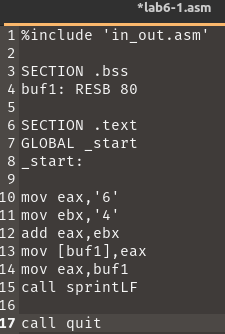{#fig:002 width=70%}

Создаю исполняемый файл и запускаю его, предварительно поместив in_out.asm в этот каталог для корректной работы программы. Она выводит символ j, так как в программе мы складываем не числа, а коды их символов  (рис. [-@fig:003]).

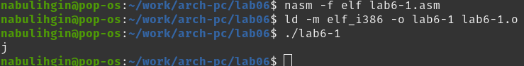{#fig:003 width=70%}

Меняю символы '6' и '4' на числа 6 и 4 в коде программы и запускаю обновлённую программу. Теперь выводится символ с кодом 10, чем является символ перехода на следующую строку (рис. [-@fig:004]).

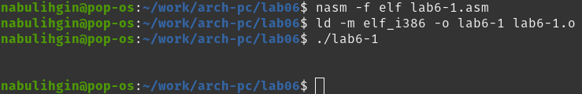{#fig:004 width=70%}

Создаю новый файл lab6-2.asm и ввожу в него данную программу (рис. [-@fig:005]).

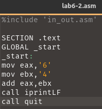{#fig:005 width=70%}

Запускаю программу и вижу, что она выводит число 106, соответствующее сумме кодов символов '4' и '6' (рис. [-@fig:006]).

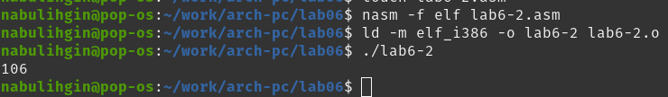{#fig:006 width=70%}

Как и в прошлый раз, меняю символы '4' и '6' на числа 4 и 6. Теперь программа выводит их сумму (рис. [-@fig:007]).

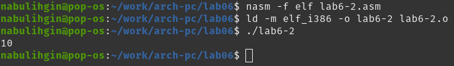{#fig:007 width=70%}

## Выполнение арифметических операций в NASM

Создаю новый файл lab6-3.asm и ввожу в него данную программу вычисления выражения (рис. [-@fig:008]).

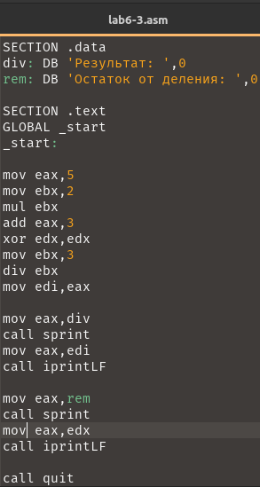{#fig:008 width=70%}

Запускаю программу, результат соответствует данному выражению (рис. [-@fig:009]).

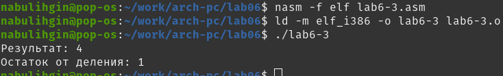{#fig:009 width=70%}

Меняю текст программы для вычисления нового выражения (рис. [-@fig:010]).

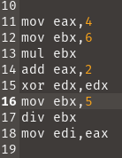{#fig:010 width=70%}

Запускаю программу и проверяю правильность вывода. Результат равен 5, остаток равен 1, значит программа сработала верно (рис. [-@fig:011]).

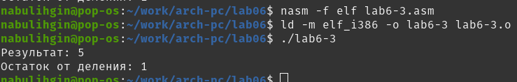{#fig:011 width=70%}

Теперь создаю файл variant.asm и ввожу туда данную программу вычисления варианта (рис. [-@fig:012]).

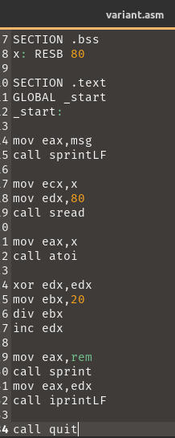{#fig:012 width=70%}

Запускаю программу. Вариант вычислен верно, так как сумма последней цифры моего билета и единицы равна двойке (рис. [-@fig:013]).

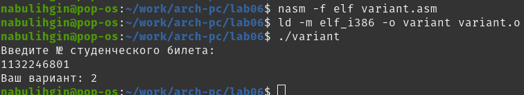{#fig:013 width=70%}

Ответы на вопросы лабораторной работы:

1) Какие строки листинга 6.4 отвечают за вывод на экран сообщения ‘Ваш вариант:’?

Эти строки:
```NASM
mov eax,msg
call sprintLF
```

2) Для чего используется следующие инструкции?
```NASM
mov ecx,x
mov edx,80
call sread
```

Для считывания ввода из терминала. Первая строка поместит считанное значение в x, вторая строка задаёт максимальный объем данных для считывания, третья - вызывает фунцкию считывания строки из терминала.

3) Для чего используется инструкция “call atoi”?

Она преобразует регистр eax в число.

4) Какие строки листинга 6.4 отвечают за вычисления варианта?

Эти строки:
```NASM
mov ebx,20
div ebx
inc edx
```

5) В какой регистр записывается остаток от деления при выполнении инструкции “div
ebx”?

edx.

6) Для чего используется инструкция “inc edx”?

Для увеличения значения в edx на 1.

7) Какие строки листинга 6.4 отвечают за вывод на экран результата вычислений?

Эти строки:
```NASM
mov eax,rem
call sprint
mov eax,edx
call iprintLF
```

## Выполнение самостоятельной работы

Для второго варианта выражение (12x+3)5 для x=1 и x=6.

Копирую файл lab6-3.asm, переименовываю его на task.asm и изменяю его для вычисления данного выражения:

```NASM
%include 'in_out.asm'

SECTION .data
msg: DB 'Enter x',0
div: DB 'Result: ',0

SECTION .bss
x: RESB 80

SECTION .text
GLOBAL _start
_start:

;Stuff from variant.asm
mov eax,msg
call sprintLF
mov ecx,x
mov edx,80
call sread
mov eax,x
call atoi

mov ebx,12
mul ebx
add eax,3
xor edx,edx
mov ebx,5
div ebx
mov edi,eax

mov eax,div
call sprint
mov eax,edi
call iprintLF

call quit
```

Запускаю написанную программу и проверяю верность вычислений. Программа даёт верные ответы рис. [-@fig:014]).

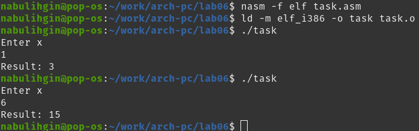{#fig:014 width=70%}

# Выводы

Я освоил арифметические инструкции языка ассемблера NASM.
