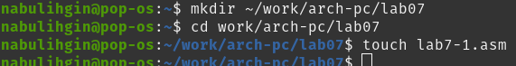
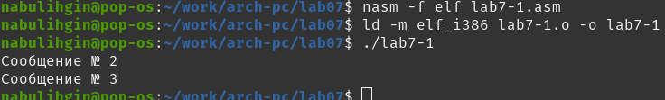
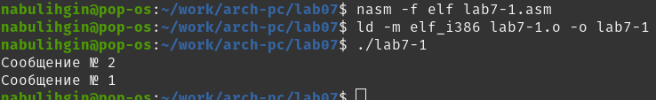
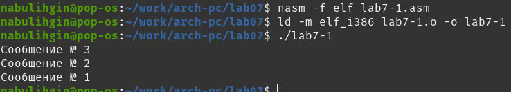
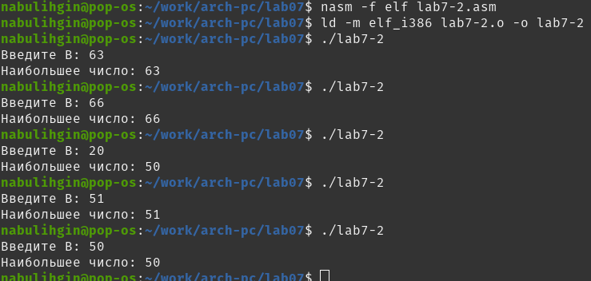
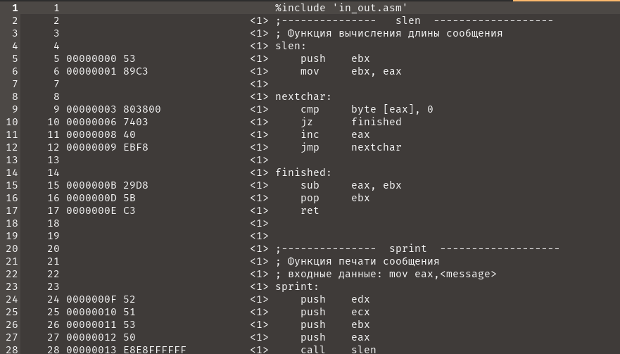
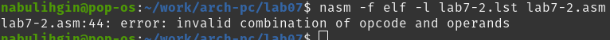
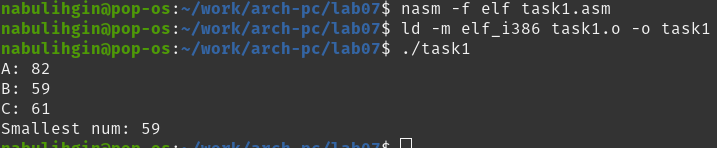
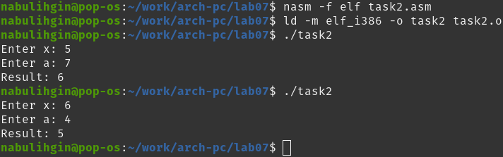

---
## Front matter
title: "Отчёт по лабораторной работе №7"
subtitle: "Дисциплина: архитектура компьютера"
author: "Булыгин Николай Александрович"

## Generic otions
lang: ru-RU
toc-title: "Содержание"

## Bibliography
bibliography: bib/cite.bib
csl: pandoc/csl/gost-r-7-0-5-2008-numeric.csl

## Pdf output format
toc: true # Table of contents
toc-depth: 2
lof: true # List of figures
lot: true # List of tables
fontsize: 12pt
linestretch: 1.5
papersize: a4
documentclass: scrreprt
## I18n polyglossia
polyglossia-lang:
  name: russian
  options:
	- spelling=modern
	- babelshorthands=true
polyglossia-otherlangs:
  name: english
## I18n babel
babel-lang: russian
babel-otherlangs: english
## Fonts
mainfont: IBM Plex Serif
romanfont: IBM Plex Serif
sansfont: IBM Plex Sans
monofont: IBM Plex Mono
mathfont: STIX Two Math
mainfontoptions: Ligatures=Common,Ligatures=TeX,Scale=0.94
romanfontoptions: Ligatures=Common,Ligatures=TeX,Scale=0.94
sansfontoptions: Ligatures=Common,Ligatures=TeX,Scale=MatchLowercase,Scale=0.94
monofontoptions: Scale=MatchLowercase,Scale=0.94,FakeStretch=0.9
mathfontoptions:
## Biblatex
biblatex: true
biblio-style: "gost-numeric"
biblatexoptions:
  - parentracker=true
  - backend=biber
  - hyperref=auto
  - language=auto
  - autolang=other*
  - citestyle=gost-numeric
## Pandoc-crossref LaTeX customization
figureTitle: "Рис."
tableTitle: "Таблица"
listingTitle: "Листинг"
lofTitle: "Список иллюстраций"
lotTitle: "Список таблиц"
lolTitle: "Листинги"
## Misc options
indent: true
header-includes:
  - \usepackage{indentfirst}
  - \usepackage{float} # keep figures where there are in the text
  - \floatplacement{figure}{H} # keep figures where there are in the text
---

# Цель работы

Целью работы является изучение команд условного и безусловного переходов, приобретение навыков написания программ с использованием переходов и знакомство с назначением и структурой файла листинга.

# Задание

1. Реализация переходов в NASM
2. Изучение структуры файлы листинга
3. Выполнение самостоятельной работы

# Выполнение лабораторной работы

## Реализация переходов в NASM

Создаю каталог для программ в этой лабораторной работе, перехожу в него и создаю файл lab7-1.asm (рис. [-@fig:001]).

{#fig:001 width=70%}

Ввожу в файл lab7-1.asm текст программы:

```NASM
%include 'in_out.asm'

SECTION .data
msg1: DB 'Сообщение № 1',0
msg2: DB 'Сообщение № 2',0
msg3: DB 'Сообщение № 3',0

SECTION .text
GLOBAL _start
_start:

jmp _label2
	
_label1:
	mov eax, msg1
	call sprintLF
	
_label2:
	mov eax, msg2
	call sprintLF
	
_label3:
	mov eax, msg3
	call sprintLF
	
_end:
	call quit
```

Создаю исполняемый файл и запускаю его. Выводится сначала Сообщение 2, потом Сообщение 3, так как jmp _label2 осуществляет переход к _label2, что пропускает _label1 (рис. [-@fig:002]).

{#fig:002 width=70%}

Меняю текст lab7-1.asm в соответствие с листингом 7.2:

```NASM
%include 'in_out.asm'

SECTION .data
msg1: DB 'Сообщение № 1',0
msg2: DB 'Сообщение № 2',0
msg3: DB 'Сообщение № 3',0

SECTION .text
GLOBAL _start
_start:

jmp _label2
	
_label1:
	mov eax, msg1
	call sprintLF
	jmp _end
	
_label2:
	mov eax, msg2
	call sprintLF
	jmp _label1
	
_label3:
	mov eax, msg3
	call sprintLF
	
_end:
	call quit
```

Создаю исполняемый файл и запускаю его. Выводится сначала Сообщение 2, потом Сообщение 1, так как jmp _label2 осуществляет переход к _label2, затем jmp _label1 переходит на _label1 и jmp_ end вызывает завершение (рис. [-@fig:003]).

{#fig:003 width=70%}

Снова меняю текст программы, чтобы сообщения выводились в порядке 3 2 1:

```NASM
%include 'in_out.asm'

SECTION .data
msg1: DB 'Сообщение № 1',0
msg2: DB 'Сообщение № 2',0
msg3: DB 'Сообщение № 3',0

SECTION .text
GLOBAL _start
_start:

jmp _label3
	
_label1:
	mov eax, msg1
	call sprintLF
	jmp _end
	
_label2:
	mov eax, msg2
	call sprintLF
	jmp _label1
	
_label3:
	mov eax, msg3
	call sprintLF
	jmp _label2
	
_end:
	call quit
```

Снова создаю исполняемый файл и запускаю его, вывод соответсвует условию задания (рис. [-@fig:004]).

{#fig:004 width=70%}

Создаю файл lab7-2.asm (рис. [-@fig:005]).

{#fig:005 width=70%}

Ввожу в него текст программы из листинга 7.3:

```NASM
%include 'in_out.asm'
section .data
	msg1 db 'Введите B: ',0h
	msg2 db "Наибольшее число: ",0h
	A dd '20'
	C dd '50'
section .bss
max resb 10
B resb 10
section .text
	global _start
_start:
	mov eax,msg1
	call sprint

	mov ecx,B
	mov edx,10
	call sread

	mov eax,B
	call atoi
	mov [B],eax

	mov ecx,[A]
	mov [max],ecx

	cmp ecx,[C]
	jg check_B
	mov ecx,[C]
	mov [max],ecx

check_B:
	mov eax,max
	call atoi
	mov [max],eax

	mov ecx,[max]
	cmp ecx,[B]
	jg fin
	mov ecx,[B]
	mov [max],ecx

fin:
	mov eax, msg2
	call sprint
	mov eax,[max]
	call iprintLF
	call quit
``` 

Создаю исполняемый файл и проверяю его работу для разных значений B (рис. [-@fig:006]).

{#fig:006 width=70%}

## Изучение структуры файлы листинга

Создаю файл листинга для программы из файла lab7-2.asm (рис. [-@fig:007]).

{#fig:007 width=70%}

Открываю полученный файл листинга lab7-2.lst в mcedit (рис. [-@fig:008]).

{#fig:008 width=70%}

Объясняю содержимое трех строк файла по выбору:

Строка на 16 месте, адрес - 000000F2, машинный код - B9[0A000000], mov ecx,B - исходный текст программы, в регистр ecx вносится значение переменной B (рис. [-@fig:009]).

{#fig:009 width=70%}

Строка на 21 месте, адрес - 00000106, машинный код - E891FFFFFF, call atoi - исходный текст программы, символ в строке выше переводится в число (рис. [-@fig:010]).

{#fig:010 width=70%}

Строка на 30 месте, адрес - 0000012A, машинный код - 890D[00000000], mov [max],ecx - исходный текст программы, в регистр ecx вносится число, хранившееся в переменной max (рис. [-@fig:011]).

{#fig:011 width=70%}

В строке 44 удаляю операнд msg2, выполняю трансляцию с получением файла листинга и получаю ошибку (рис. [-@fig:012]).

{#fig:012 width=70%}

В файле листинга добавляется сообщение об ошибке (рис. [-@fig:013]).

{#fig:013 width=70%}

## Выполнение самостоятельной работы

Создаю файл task1.asm и пишу программу для нахождения наименьшего из 3 чисел. У меня второй вариант, поэтому в программе задаю числа A = 82, B = 59, C = 61. Программа выводит 59 (рис. [-@fig:014]).

{#fig:014 width=70%}

Код программы:

```NASM
%include 'in_out.asm'
section .data

msga db 'A: ',0h
msgb db 'B: ',0h
msgc db 'C: ',0h
msg1 db "Smallest num: ",0h
section .bss
min resb 10
A resb 10
B resb 10
C resb 10
section .text
global _start
_start:

mov eax,msga
call sprint
mov ecx,A
mov edx, 10
call sread
mov eax,msgb
call sprint
mov ecx,B
call sread
mov eax,msgc
call sprint
mov ecx,C
call sread

mov eax,A
call atoi
mov [A],eax
mov eax,B
call atoi
mov [B],eax
mov eax,C
call atoi
mov [C],eax

mov ecx,[A]
add ecx,[B]
add ecx,[C]
mov [min],ecx

jmp cmp_a_b

min_below_c:
jmp fin

c_below_min:
mov eax,[C]
mov [min],eax
jmp fin

a_below_b:
mov eax,[A]
mov [min],eax
jmp cmp_min_c

b_below_a:
mov eax,[B]
mov [min],eax
jmp cmp_min_c

cmp_min_c:
mov eax,[C]
cmp [min],eax
jb min_below_c
jg c_below_min

cmp_a_b:
mov eax,[B]
cmp [A],eax
jb a_below_b
jg b_below_a

fin:
mov eax, msg1
call sprint
mov eax,[min]
call iprintLF
call quit
```

Создаю файл task2.asm и пишу программу для вычисления значения фунции второго варианта. При значениях x = 5, a = 7 она выводит a - 1 = 6, при значениях x = 6, a = 4 она выводит x - 1 = 5, следовательно, она работает корректно (рис. [-@fig:015]).

{#fig:015 width=70%}

Код программы:

```NASM
%include 'in_out.asm'
section .data
msgx db 'Enter x: ',0h
msga db 'Enter a: ',0h
msg1 db "Result: ",0h

section .bss
x resb 10
a resb 10
res resb 10

section .text
global _start
_start:
mov eax,msgx
call sprint
mov ecx,x
mov edx,10
call sread
mov eax,msga
call sprint
mov ecx,a
call sread
mov eax,x
call atoi
mov [x],eax
mov eax,a
call atoi
mov [a],eax

mov eax, [a]
mov ebx, [x]
cmp ebx, eax
jb x_below_a
jae x_above_a

x_below_a:
mov ecx, [a]
mov [res], ecx
mov ecx, 1
sub [res], ecx
jmp fin

x_above_a:
mov ecx, [x]
mov [res], ecx
mov ecx, 1
sub [res], ecx
jmp fin

fin:
mov eax, msg1
call sprint
mov eax,[res]
call iprintLF
call quit
```

# Выводы

Я изученил команды условного и безусловного переходов, приобрел навыки написания программ с использованием переходов и познакомился с назначением и структурой файла листинга.
